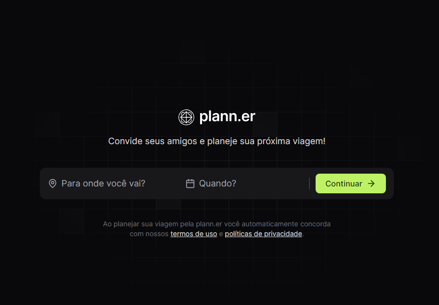
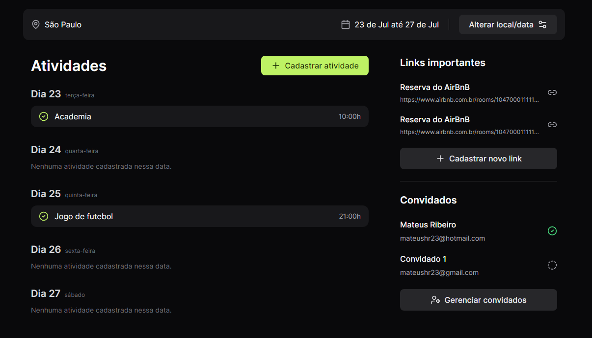

<h1 align="center"> NLW Journey </h1>

Projeto realizado no evento NLW Journey da [Rocketseat](https://www.rocketseat.com.br) com o objetivo de aprofundar os conhecimentos em React.js e JavaScript. A aplicação consiste em um planejador de viagens onde é possível selecionar data e destino, além de enviar convites por e-mail e cadastrar atividades.

  

  

## 🚀 Tecnologias

Esse projeto foi desenvolvido com as seguintes tecnologias:

- HTML e CSS
- Tailwind
- Java Script
- Typescript
- React.js
- Figma

## 🔖 Layout

Você pode visualizar o layout do projeto através [DESSE LINK](<https://www.figma.com/design/VkcdqA0iK8a2ToWak72Ctm/NLW-Journey-%E2%80%A2-Planejador-de-viagem-(Community)?node-id=7101-739&t=KUsNnnSTUj4UQXZz-0>). É necessário ter conta no [Figma](https://figma.com) para acessá-lo.
